  

  

  

  
  
   
  
  

  

  

<table>
  <tr>
    <td rowspan="2" valign="middle" align="center">
      
    </td>
    <td align="center"></td>
    <td align="center"></td>
  </tr>
  <tr>
    <td align="center"></td>
    <td align="center"></td>
  </tr>
</table>

  

  

  

  

  

  

  

