

  <a href="https://sarvan.me" target="_blank">
    
  </a>

  

  

  <a href="https://github.com/Sarvan-12/ai-code-review-tool">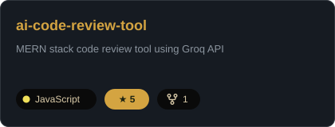</a>
  <a href="https://github.com/Sarvan-12/land-use-land-cover-using-U-net"></a>
   
  <a href="https://github.com/Sarvan-12/time-capsule"></a>
  <a href="https://github.com/Sarvan-12?tab=repositories"></a>

  


  

<table>
  <tr>
    <td valign="top" align="center" width="24%">
      <a href="https://gitfut.com/Sarvan-12">
        
      </a>
    </td>
    <td valign="top" align="center" width="40%">
       
      
    </td>
    <td valign="top" align="center" width="36%">
       
      
    </td>
  </tr>
</table>

  

  

  

  

  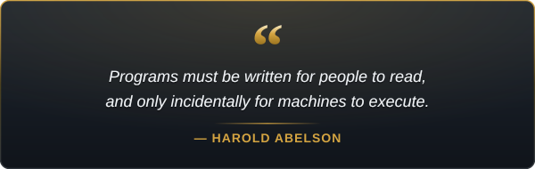

  

  

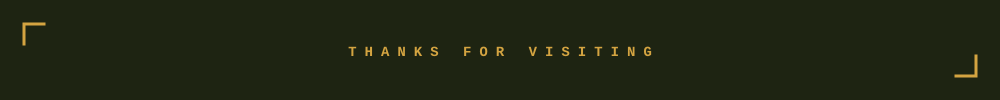
